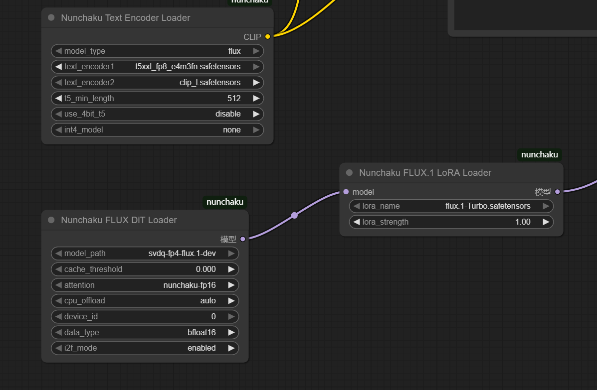
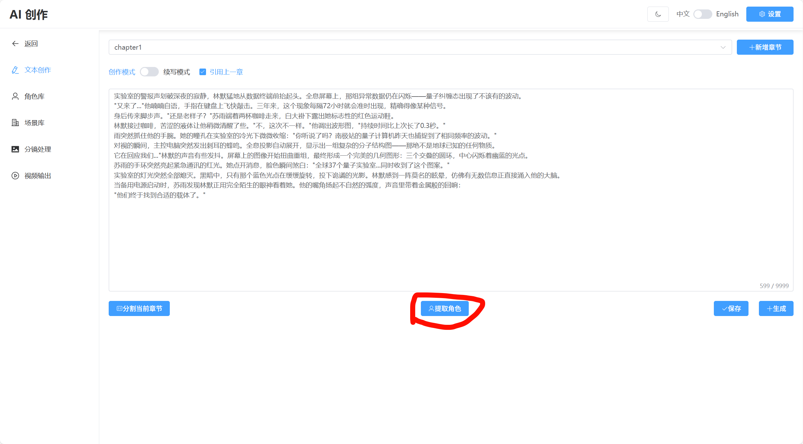
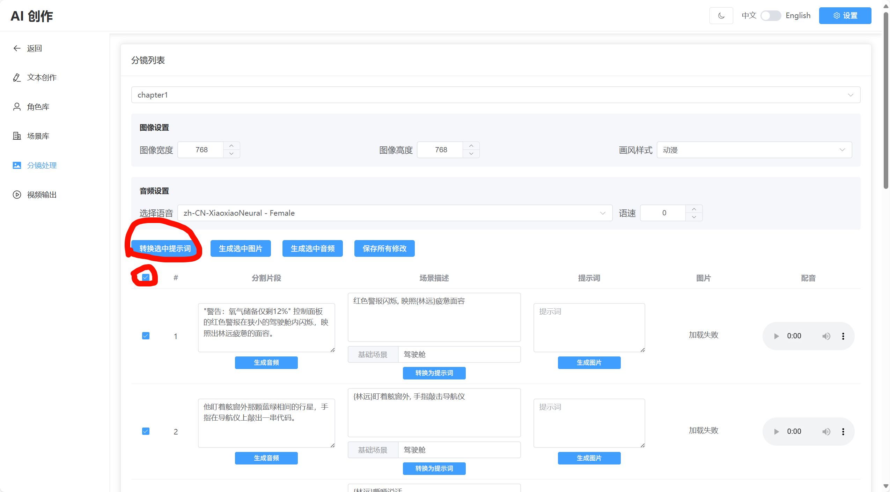
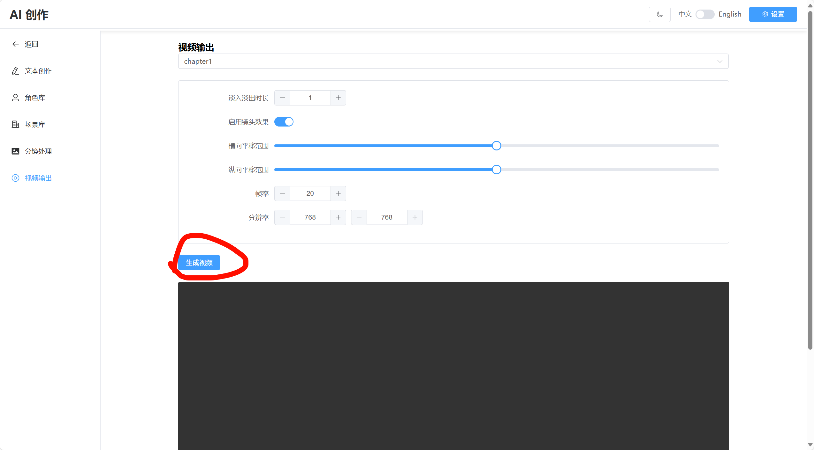

# <p align="center">AI Creation - 智能创意内容生成系统</p>

<div align="center">

[中文](README.md) | [English](README_EN.md)

[功能介绍](#功能介绍) | [安装说明](#安装说明) | [运行指南](#运行指南) | [配置说明](#配置说明) | [使用流程](#使用流程) | [项目结构](#项目结构)

</div>

## 功能介绍

本项目是一个智能创意内容生成系统，能够帮助用户：
- 快速生成创意文本内容
- 利用 AI 技术实现图像生成
- 自动进行视频合成
- 通过实体管理尽量保持图像生成的一致性

系统架构：
- 前端：VUE3 + TypeScript + Element Plus
- 后端：基于 Python FastAPI 框架
- AI 模型：支持 OpenAI 兼容的 API 接口，使用LangChain调用LLM
- 图像生成：集成 ComfyUI
- 音频生成： 集成EdgeTTS
- 内容管理：基于文件系统的结构化存储

### 演示视频

<video controls src="docs/video.mp4" title="系统演示"></video>

## 安装说明

### 环境要求
- Python >= 3.10
- Node.js
- ComfyUI

### 安装步骤

1. 安装后端依赖
```bash
cd server
pip install -r requirements.txt
```

2. 安装前端依赖
```bash
cd client
npm install
```

3. ComfyUI 模型配置
- 参考教程：https://zhuanlan.zhihu.com/p/1898355945110759141

## 运行指南

1. 启动后端服务
```bash
cd server
python app.py
```

2. 启动前端服务
```bash
cd client
npm run dev
```

3. 启动 ComfyUI
- 默认使用 nunchaku-flux 工作流（显存要求 10GB+）
- 工作流路径：`server/workflow`（可自行扩展）

> **注意**：使用默认工作流时，请确保所需模型已正确下载并放置。对于非 50 系显卡，请将 svdq-fp4-flux.1-dev 模型替换为 int4 版本。



## 配置说明

1. 进入系统配置页面


2. 配置 LLM 服务


需要关注的配置：
- ComfyUI API地址
- LLM API URL
- API Key
- 模型名称

> **没有Key？获取 API Key的方法**：
> 通过 [注册链接](https://cloud.siliconflow.cn/i/Je8e1K0b) 可获得 2000 万免费 token
> 注册后在主页面选择：API密钥 → 新建API密钥

## 使用流程

### 1. 创建项目

### 2. 文本创作
- 创作模式：直接输入需求，AI 生成内容
- 续写模式：输入已有文本，AI 继续创作

### 3. 角色提取

- 保存文本后点击"提取角色"
- AI 将分析文本并提取角色信息
- 可在角色库查看提取结果

### 4. 章节分割

- 点击"分割当前章节"
- 系统自动提取场景并进行分镜

### 5. 分镜处理


a) 提示词转换：
- 全选元素
- 点击"转换选中的提示词"
- 保存修改

b) 图片生成：
- 可配置分辨率和画风
- 点击"生成选中的图片"
- 支持单独重新生成

c) 音频生成：
- 选择需要的片段
- 点击生成音频

### 6. 视频生成

- 切换到视频生成界面
- 点击"生成视频"（约需1分钟）

#### 视频硬编码加速配置(可选)

如需启用 NVIDIA GPU 加速（NVENC），请：

1. 下载并解压 FFmpeg Builds
2. 配置环境变量：
   - 将 FFmpeg bin 目录添加到 PATH
   - 确保已安装 NVIDIA 驱动
3. 验证配置：
   ```bash
   ffmpeg -encoders | findstr nvenc
   ```
   显示 h264_nvenc 即表示配置成功

> 注：没有设置时将自动使用 CPU 编码

## 项目结构

```
AICreation/                # 项目根目录
├── client/               # 前端代码
│   ├── src/             # 源代码目录
│   ├── public/          # 静态资源目录
│   └── package.json     # 项目配置文件
├── server/              # 服务器端代码
│   ├── config/          # 配置文件
│   ├── controllers/     # API 接口层
│   ├── services/        # 业务逻辑层
│   ├── utils/           # 工具类
│   ├── prompts/         # 提示词模板
│   └── workflow/        # 工作流配置
├── projects/            # 项目数据存储
└── README.md           # 项目文档
```

详细目录结构：

```
AICreation/                # 项目根目录
├── client/               # 前端代码
│   ├── src/             # 源代码目录
│   │   ├── api/         # API 接口目录
│   │   │   ├── project_api.ts # 项目相关 API
│   │   │   ├── chapter_api.ts # 章节相关 API
│   │   │   ├── entity_api.ts # 实体相关 API
│   │   │   ├── media_api.ts # 媒体生成相关 API
│   │   │   └── request.ts # 请求封装，支持普通请求（Axios）和流式请求（Fetch API）处理
│   │   ├── components/   # 组件目录
│   │   │   ├── Header.vue # 顶部导航组件
│   │   ├── locales/     # 国际化文件目录
│   │   │   ├── en-US.ts # 英文语言包
│   │   │   ├── zh-CN.ts # 中文语言包
│   │   │   └── index.ts # 国际化配置
│   │   ├── router/      # 路由配置目录
│   │   │   └── index.ts # 路由配置文件
│   │   ├── store/       # 状态管理目录
│   │   ├── styles/      # 样式文件目录
│   │   ├── utils/       # 工具类目录
│   │   ├── views/       # 页面视图目录
│   │   │   ├── Project/ # 项目管理页面
│   │   │   │   └── index.vue
│   │   │   ├── ProjectMain/ # 项目详情页面
│   │   │   │   ├── index.vue # 项目主页面
│   │   │   │   ├── CharacterLibrary/ # 角色库管理
│   │   │   │   │   └── index.vue
│   │   │   │   ├── SceneLibrary/ # 场景库管理
│   │   │   │   │   └── index.vue
│   │   │   │   ├── StoryboardProcess/ # 分镜流程管理
│   │   │   │   │   └── index.vue
│   │   │   │   ├── TextCreation/ # 文本创作管理
│   │   │   │   │   └── index.vue
│   │   │   │   └── VideoOutput/ # 视频输出管理
│   │   │   │       └── index.vue
│   │   │   ├── Setting/ # 设置页面
│   │   │   │   └── index.vue
│   │   │   └── NotFound/ # 404页面
│   │   │       └── index.vue
│   │   ├── App.vue      # 根组件
│   │   ├── main.ts      # 入口文件
│   │   └── env.d.ts     # 类型声明文件
│   ├── public/          # 静态资源目录
│   ├── index.html       # HTML 模板
│   ├── package.json     # 项目配置文件
│   ├── tsconfig.json    # TypeScript 配置
│   └── vite.config.ts   # Vite 配置
├── server/               # 服务器端代码
│   ├── config/           # 配置文件夹
│   │   ├── config.py     # 配置文件操作接口
│   │   └── config.yaml   # 系统配置文件
│   ├── controllers/      # API 接口层
│   │   ├── project_controller.py # 项目管理相关接口
│   │   ├── chapter_controller.py # 章节管理相关接口
│   │   ├── entity_controller.py # 实体管理相关接口
│   │   ├── media_controller.py   # 媒体生成相关接口
│   │   ├── video_controller.py   # 视频生成相关接口
│   │   └── admin_controller.py   # 系统管理接口（包括配置文件修改）
│   ├── services/         # 业务逻辑层
│   │   ├── llm_service.py    # LLM 相关业务逻辑
│   │   ├── image_service.py  # 图像生成相关业务逻辑
│   │   ├── kg_service.py     # 知识图谱管理相关业务逻辑
│   │   ├── singleton_service.py # 单例服务基类
│   │   ├── audio_service.py  # 音频生成相关业务逻辑
│   │   └── video_service.py  # 视频生成相关业务逻辑
│   ├── utils/            # 工具类
│   │   ├── prompt_manager.py # 提示词管理工具
│   │   ├── context_manager.py # 上下文管理工具
│   │   └── file_manager.py   # 文件管理工具
│   ├── prompts/          # 提示词模板文件夹
│   │   ├── novel_writing.txt     # 小说写作提示词模板
│   │   ├── character_generation.txt # 人物生成提示词模板
│   │   └── image_generation.txt  # 图像生成提示词模板
│   │   └── ……                    # 其他提示词模板
│   └── workflow/         # 工作流配置文件夹
│       └── nunchaku-flux.1-dev.json # 默认工作流配置文件
├── projects/             # 项目文件夹（与 server 同级）
│   ├── project1/         # 具体项目文件夹
│   │   ├── kg.json       # 知识图谱数据文件
│   │   ├── last_content.txt  # 最新生成的内容
│   │   ├── chapter1/     # 章节文件夹
│   │   │   ├── content.txt   # 章节内容文件
│   │   │   ├── 1/       # 子文件夹
│   │   │   │   ├── span.txt
│   │   │   │   ├── prompt.json
│   │   │   │   ├── image.png
│   │   │   │   └── audio.mp3
│   │   │   ├── 2/       # 子文件夹
│   │   │   └── ...      # 其他子文件夹
│   │   └── ...          # 其他章节文件夹
│   └── ...              # 其他项目文件夹
└── README.md            # 项目说明文档
```


